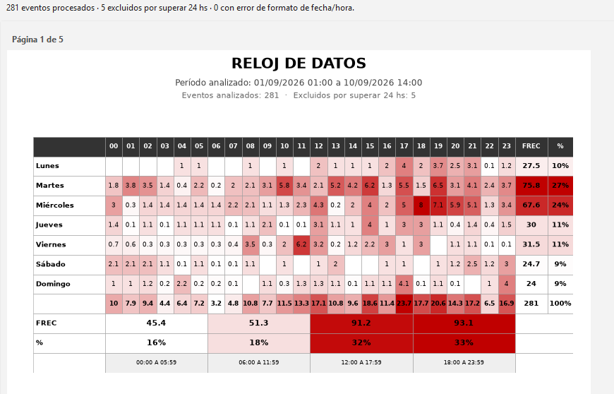
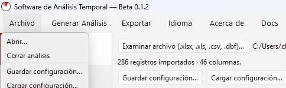
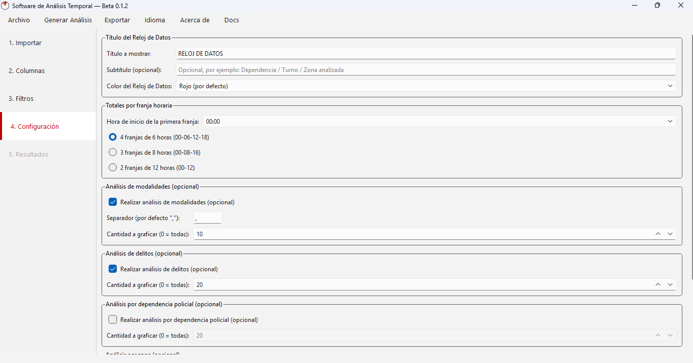
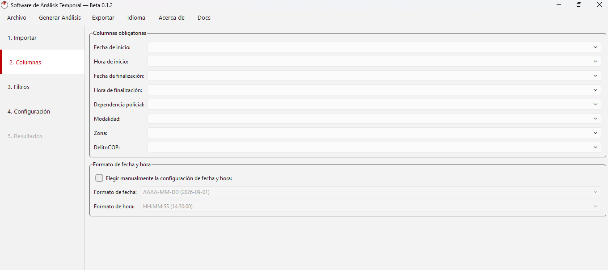

<div align="center">

# 🕐 Reloj de Datos — Software de Análisis Temporal

**Análisis de la distribución horaria de hechos delictivos, a partir de una planilla de datos.**

Desarrollado para la Sección Ce.P.A.I.D. — E.P.S.D. Bahía Blanca, Policía de la Provincia de Buenos Aires.

[](LICENSE)
[](https://www.python.org/)
[-41cd52.svg)](https://doc.qt.io/qtforpython/)
[](#-instalación)

[Características](#-características) ·
[Instalación](#-instalación) ·
[Uso rápido](#-uso-rápido) ·
[Documentación](#-documentación) ·
[Compilar instaladores](#-compilar-los-instaladores) ·
[Licencia](#-licencia)

</div>

---

## 📸 Capturas

<div align="center">


  
</div>

## ✨ Características

- **Reloj de Datos**: matriz de 7 días × 24 horas coloreada con un gradiente continuo, que muestra
  en qué días y horas se concentran los eventos analizados. Cada evento reparte proporcionalmente
  su peso entre las horas que ocupa (el detalle completo está en la [documentación](#-documentación)).
- **Franjas horarias configurables**: 2, 3 o 4 franjas por día, con la hora de inicio de la primera
  a elección — soporta franjas que cruzan la medianoche.
- **Hasta 4 análisis de conteo opcionales**, cada uno con su propio ranking y gráfico: modalidad
  (con separador para celdas con varios valores), delito, dependencia policial y zona.
- **Resumen General**: una página con los indicadores clave (día/hora/franja pico, principal de
  cada análisis habilitado) para un vistazo rápido sin recorrer todo el informe.
- **Filtros potentes**: por rango de fecha/hora y hasta 3 columnas más, cada una con selección de
  valores y **búsqueda por texto** que selecciona automáticamente lo que coincide.
- **Formatos de entrada**: Excel (`.xlsx`, `.xls`), CSV y **DBF** (dBase), este último con un
  decodificador propio sin dependencias externas.
- **Exportación** a Excel (una hoja por análisis), PDF (una página por bloque del informe) y PNG.
- **Guardar y cargar configuración** completa (columnas, filtros, ajustes) en un archivo `.json`,
  para no rearmar todo con cada archivo nuevo del mismo tipo.
- **Multilenguaje**: español, inglés y portugués, sin reiniciar la app; el idioma elegido se
  recuerda la próxima vez que se abre el programa.
- **Color personalizable** del Reloj de Datos (rojo, azul, verde, naranja, morado, gris, turquesa).

## 📋 Requisitos

- Python 3.9 o superior (solo para correr desde el código fuente; los instaladores no lo necesitan).
- Windows 10/11 (64 bits) o Linux basado en Debian/Ubuntu (64 bits).

## 📦 Instalación

### Opción A — Instalador (recomendado para uso cotidiano)

Descargá el instalador de la [última versión publicada](../../releases) (sección *Releases* de
este repositorio):

- **Windows**: `SoftwareAnalisisTemporal-Setup.exe` — instalador con asistente, ícono en el menú
  Inicio y desinstalador.
- **Linux (Debian/Ubuntu)**: `software-analisis-temporal.deb` — instalar con:
  ```bash
  sudo apt install ./software-analisis-temporal.deb
  ```

Ninguna de las dos opciones necesita tener Python instalado en el equipo.

### Opción B — Desde el código fuente (para desarrollar o modificar)

```bash
git clone https://github.com/<tu-usuario>/<tu-repositorio>.git
cd <tu-repositorio>

python3 -m venv venv
source venv/bin/activate        # en Windows: venv\Scripts\activate

pip install -r requirements.txt
python main.py
```

## 🚀 Uso rápido

1. **Importar**: elegí tu archivo `.xlsx`, `.xls`, `.csv` o `.dbf`.
2. **Columnas**: indicá qué columna del archivo es cada dato (fecha/hora de inicio y fin,
   dependencia, modalidad, zona, DelitoCOP).
3. **Filtros** _(opcional)_: acotá por fecha/hora o por los valores de hasta 3 columnas más.
4. **Configuración**: elegí título, color, franjas horarias y qué análisis opcionales generar.
5. Hacé clic en **Generar Análisis** y exportá el resultado a Excel, PDF o PNG desde el menú
   **Exportar**.

## 📖 Documentación

La documentación completa —cómo se calculan las horas, cómo funciona cada análisis, filtros,
exportación, guardado de configuración, preguntas frecuentes— está disponible en dos idiomas:

- 🇦🇷 [`reloj_datos/assets/docs/documentacion_es.pdf`](reloj_datos/assets/docs/documentacion_es.pdf)
- 🇺🇸 [`reloj_datos/assets/docs/documentation_en.pdf`](reloj_datos/assets/docs/documentation_en.pdf)

También se abre directamente desde la aplicación: menú **Docs** (arriba a la derecha), en el idioma
activo. Fuente de ambos PDF: [`tools/generar_documentacion.py`](tools/generar_documentacion.py) —
si edita el contenido, regenerarlos con:

```bash
python3 tools/generar_documentacion.py
```

## 🗂️ Estructura del proyecto

```
reloj_datos/
├── main.py                       # Punto de entrada
├── requirements.txt
├── reloj_datos/
│   ├── models/                   # Event (evento individual)
│   ├── data/                     # Importación (xlsx/csv/dbf), mapeo de columnas, filtros
│   ├── processing/               # Distribución horaria, matriz, franjas, colores, gráficos
│   ├── export/                   # Excel / PDF / PNG
│   ├── gui/                       # Ventana principal y las 5 pestañas
│   ├── assets/                   # Ícono y PDF de documentación
│   ├── i18n.py                   # Textos es/en/pt
│   ├── settings.py               # Persistencia del idioma (QSettings)
│   ├── config_profile.py         # Guardar/cargar configuración (.json)
│   └── branding.py
└── tools/
    └── generar_documentacion.py
```

## 🛠️ Compilar los instaladores

Los scripts para generar los instaladores están en [`packaging/`](packaging/). Requieren compilar
**en el sistema operativo destino** (no es posible generar el `.exe` desde Linux, ni el `.deb`
desde Windows):

- **Windows**: `packaging\windows\build_installer.bat` (usa PyInstaller + Inno Setup).
- **Linux**: `packaging/linux/build_deb.sh` (usa PyInstaller + `dpkg-deb`).

El detalle de cada paso está en [`packaging/README.md`](packaging/README.md).

## 🤝 Contribuir

Las *issues* y *pull requests* son bienvenidas. Para cambios grandes, mejor abrir primero un *issue*
para conversar el enfoque.

## 📜 Licencia

Este proyecto es de uso libre bajo la licencia [MIT](LICENSE): se puede usar, copiar, modificar y
redistribuir, incluso con fines comerciales, siempre citando la licencia y autoría originales.

## 🙏 Créditos

Desarrollado por **Juan Jose Chaparro**, con asistencia de **Claude AI** (Anthropic), para la
Sección Ce.P.A.I.D. — E.P.S.D. Bahía Blanca, Policía de la Provincia de Buenos Aires.

---

<div align="center">

Para el historial detallado de versiones, ver [CHANGELOG.md](CHANGELOG.md).

</div>
